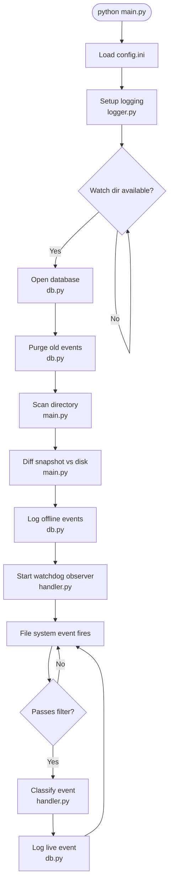

# File Watcher

Monitors a directory for changes to Excel, Word, PDF, and image files.
Logs all events (create, modify, delete, rename, move) to a SQLite database.
Detects changes that occurred while the script was not running on every restart.
Auto-recovers if the watched drive goes offline.

---

## Project Structure

```
filewatcher/
├── config.ini        ← your configuration (edit this)
├── main.py           ← entry point
├── db.py             ← SQLite database layer
├── handler.py        ← live watchdog event handler
├── logger.py         ← centralized logging setup
├── query.py          ← CLI tool for reading logs
├── .gitignore        ← excludes cache, db, and log files from git
└── requirements.txt  ← Python dependencies
```

---

## Architecture

The script runs in two phases on every startup, then stays alive for live monitoring.


---

## Setup

### 1. Install Python 3.10+
Download from https://python.org — check "Add Python to PATH" during install.

### 2. Install dependencies
Open a terminal in the filewatcher folder and run:
```
pip install -r requirements.txt
```

### 3. Edit config.ini
Change at minimum:
- `watch_directory` → the folder you want to monitor (can be a network drive e.g. `K:\`)
- `log_directory`   → where the SQLite database and log file will be saved (keep OUTSIDE watch_directory)

> **Note on large drives:** If `watch_directory` points to the root of a large drive or
> network share, the first startup scan will take longer as it hashes all matching files.
> The terminal will show an estimated time to completion and progress updates every 50 files.
> Every subsequent startup is significantly faster due to the mtime pre-filter.

### 4. Run manually to test
```
python main.py
```

---

## Configuration Reference

All settings live in `config.ini`. No code changes needed.

| Setting | Section | Default | Description |
|---|---|---|---|
| `watch_directory` | `[watcher]` | — | Full path to the directory to monitor |
| `recursive` | `[watcher]` | `true` | Watch subdirectories recursively |
| `reconnect_delay` | `[watcher]` | `30` | Seconds to wait before retrying if drive goes offline |
| `watch_extensions` | `[filters]` | see file | Whitelist of file extensions to track |
| `ignore_prefixes` | `[filters]` | `~$, .~, ~` | Filename prefixes to ignore (Office lock files) |
| `log_directory` | `[storage]` | — | Where to save `filelog.db` and `filewatcher.log` |
| `db_name` | `[storage]` | `filelog.db` | SQLite database filename |
| `retention_days` | `[storage]` | `90` | Days to keep events before auto-purge (0 = keep forever) |
| `hash_algorithm` | `[snapshot]` | `md5` | Hashing algorithm for file fingerprinting |

---

## Log Files

Two log outputs are written to `log_directory` on every run:

- **`filelog.db`** — SQLite database containing all file change events and the current snapshot
- **`filewatcher.log`** — rotating text log of all script activity including startup, errors, and reconnects. Rotates at 5MB, keeps last 5 files.

---

## Reading the Logs

### Option 1 — CLI query tool (quickest)

```bash
python query.py                          # last 50 events
python query.py --limit 100             # show more results
python query.py --type DELETED          # filter by event type
python query.py --type RENAMED          # filter by event type
python query.py --file budget.xlsx      # search by filename
python query.py --today                 # events from today only
python query.py --date 2026-05-26       # events from a specific date
python query.py --summary               # count of each event type
```

Filters stack — `--type DELETED --today` shows only today's deletes.

### Option 2 — DB Browser for SQLite (visual)

Download free from https://sqlitebrowser.org. Open `filelog.db` from your
`log_directory`, click the **Browse Data** tab, and select the `events` or
`snapshots` table from the dropdown.

### Option 3 — Python directly

```python
import sqlite3
conn = sqlite3.connect(r"C:\Users\primelink\Desktop\LOGS\filelog.db")
for row in conn.execute("SELECT * FROM events ORDER BY timestamp DESC LIMIT 50"):
    print(row)
```

---

## Events Table Reference

### Columns
| Column     | Description                                                         |
|------------|---------------------------------------------------------------------|
| timestamp  | ISO 8601 datetime of the event                                      |
| event_type | See event types table below                                         |
| src_path   | File path where the event occurred (source path for renames/moves)  |
| dest_path  | Destination path — populated for RENAMED, MOVED, MOVED_AND_RENAMED  |
| file_size  | Size in bytes at time of event                                      |
| md5_hash   | MD5 fingerprint of file contents                                    |

### Event types
| Event type                    | Meaning                                              |
|-------------------------------|------------------------------------------------------|
| `CREATED`                     | A new file appeared in the watched directory         |
| `MODIFIED`                    | An existing file's contents changed                  |
| `DELETED`                     | A file was permanently removed                       |
| `RENAMED`                     | Filename changed, file stayed in the same folder     |
| `MOVED`                       | File moved to a different folder, filename unchanged |
| `MOVED_AND_RENAMED`           | File moved to a different folder and renamed         |
| `CREATED (offline)`           | File was created while the script was not running    |
| `MODIFIED (offline)`          | File was modified while the script was not running   |
| `DELETED (offline)`           | File was deleted while the script was not running    |
| `RENAMED (offline)`           | File was renamed while the script was not running    |
| `MOVED (offline)`             | File was moved while the script was not running      |
| `MOVED_AND_RENAMED (offline)` | File was moved and renamed while script was off      |

### Useful SQL queries

**See only deleted files:**
```sql
SELECT * FROM events WHERE event_type LIKE '%DELETED%'
```

**See only renames:**
```sql
SELECT * FROM events WHERE event_type LIKE '%RENAMED%'
```

**See all offline changes:**
```sql
SELECT * FROM events WHERE event_type LIKE '%offline%'
```

**Track a specific file:**
```sql
SELECT * FROM events WHERE src_path LIKE '%filename.pdf%'
```

**Events from a specific date:**
```sql
SELECT * FROM events WHERE timestamp LIKE '2026-05-26%'
```

---

## Task Scheduler Setup (Windows)

To run automatically on startup:

1. Open Task Scheduler → Create Task
2. **General tab**
   - Name: File Watcher
   - Check: "Run whether user is logged on or not"
   - Check: "Run with highest privileges"

3. **Triggers tab**
   - New trigger → At startup

4. **Actions tab**
   - Action: Start a program
   - Program: `C:\Python312\python.exe` (run `where python` to find your actual path)
   - Arguments: `main.py`
   - Start in: `C:\path\to\filewatcher` (full path to this folder)

5. **Settings tab**
   - UNCHECK: "Stop the task if it runs longer than 3 days"
   - Select: "Do not start a new instance" if already running

> **Network drives:** If `K:\` is not mounted yet when the script starts at boot,
> the script will wait patiently until the drive becomes available rather than crashing.

---

## Linux / macOS (systemd)

For a persistent background service on Linux, create `/etc/systemd/system/filewatcher.service`:

```ini
[Unit]
Description=File Watcher

[Service]
ExecStart=/usr/bin/python3 /path/to/filewatcher/main.py
Restart=on-failure
WorkingDirectory=/path/to/filewatcher

[Install]
WantedBy=multi-user.target
```

Then enable it:
```
sudo systemctl enable filewatcher
sudo systemctl start filewatcher
```